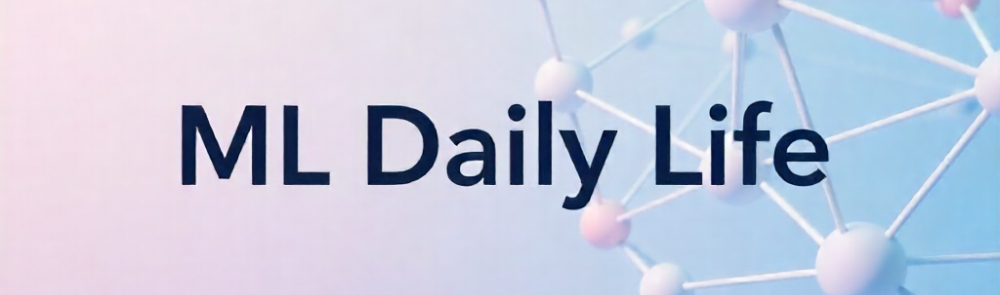

  

---

## :dart: Usage

This repository provides **Machine Learning models for daily life tasks**:

- Predict **continuous values** (Regression)  
- Classify **discrete objects** (Classification)  
- Work with **real-world datasets**  
- Quick testing via `predict()` or `classify()`  

---

## :sparkles: Features

- Prebuilt ML models   
- *Regression, Classification, Clustering*
- Clean datasets & preprocessing examples  
- Support for **real, continuous, and discrete data**  

---

## :wrench: Dependencies

- Python 
- NumPy  
- Pandas  
- Matplotlib  
- Seaborn  
- Scikit-learn
- Pickle

## :wrench: About Author
-Alan Francis
-MCE, kerala, India 
-2023 to 2027
-Artificial Intelligence And Machine Learning 

